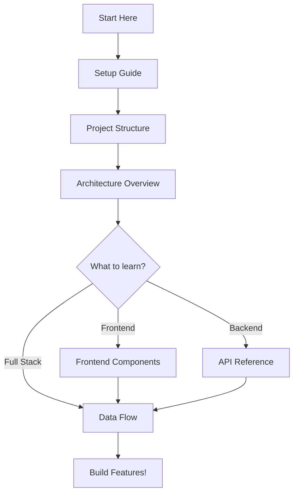

# Team Accountability Tracker - Documentation

Educational fullstack web application for learning React, FastAPI, and Supabase.

## Documentation Index

### Getting Started
1. **[Setup Guide](setup-guide.md)** - Start here! Step-by-step setup instructions
2. **[Project Structure](project-structure.md)** - Understanding the file organization

### Architecture & Design
3. **[Architecture Overview](architecture.md)** - High-level system design with diagrams
4. **[Data Flow](data-flow.md)** - How data moves through the application
5. **[Frontend Components](frontend-components.md)** - React component breakdown
6. **[API Reference](api-reference.md)** - Complete API endpoint documentation

## Learning Path



## Quick Reference

### Start the App
```bash
# Backend (terminal 1)
cd backend
uvicorn main:app --reload --port 8000

# Frontend (terminal 2)
cd frontend
npm run dev
```

### URLs
- Frontend: http://localhost:5173
- Backend: http://localhost:8000
- API Docs: http://localhost:8000/docs

### Tech Stack
- **Frontend**: React 19 + Vite
- **Backend**: FastAPI (Python)
- **Database**: Supabase (PostgreSQL)

## Key Concepts Covered

### Frontend
- React component architecture
- Props and state management
- Async data fetching with fetch API
- Form handling
- Conditional rendering
- Array mapping and filtering

### Backend
- RESTful API design
- HTTP methods (GET, POST, PATCH, DELETE)
- Request/response handling
- Data validation with Pydantic
- CORS configuration
- Environment variables

### Database
- PostgreSQL basics
- CRUD operations
- Database client (Supabase SDK)

### General
- Client-server architecture
- API communication
- JSON data format
- Git version control

## Teaching Philosophy

This project is designed to be:
- **Simple**: No over-engineering
- **Clear**: Well-commented code
- **Complete**: Full-stack implementation
- **Practical**: Real-world patterns
- **Extensible**: Easy to add features

## Mermaid Diagrams

All documentation uses Mermaid.js for diagrams. You can view them:
- On GitHub (automatic rendering)
- In VS Code with Mermaid extension
- Online at https://mermaid.live

## Contributing to Docs

When adding documentation:
- Use Mermaid for diagrams
- Keep explanations simple
- Include code examples
- Link related docs
- Focus on teaching

## Common Questions

### Where should I start?
Read [Setup Guide](setup-guide.md) first, then [Architecture Overview](architecture.md).

### How do I add a new feature?
1. Understand [Data Flow](data-flow.md)
2. Add backend endpoint (see [API Reference](api-reference.md))
3. Add frontend component (see [Frontend Components](frontend-components.md))
4. Test the integration

### How do I understand the code?
1. Start with [Project Structure](project-structure.md)
2. Read the comments in the code
3. Follow the diagrams in the docs
4. Experiment with small changes

### What if something breaks?
1. Check browser console for frontend errors
2. Check terminal for backend errors
3. Verify Supabase is running
4. See [Setup Guide](setup-guide.md) Common Issues section

## Next Steps

After understanding this project, try:
- Add authentication
- Add task editing
- Add task categories
- Add user profiles
- Add email notifications
- Deploy to production

## Resources

- [React Docs](https://react.dev)
- [FastAPI Docs](https://fastapi.tiangolo.com)
- [Supabase Docs](https://supabase.com/docs)
- [Mermaid Docs](https://mermaid.js.org)
