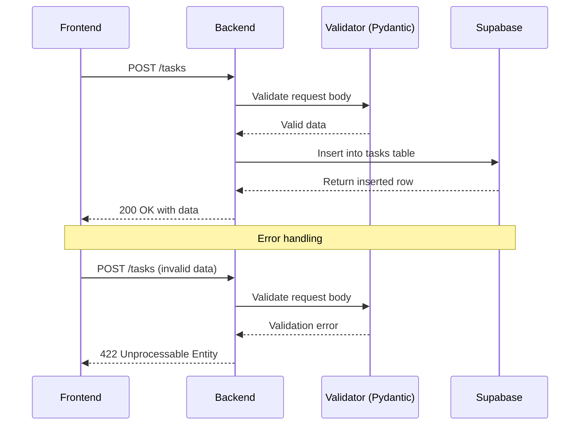

# API Reference

## Base URL
```
http://localhost:8000
```

## Endpoints Overview

```mermaid
graph LR
    Frontend[React Frontend] -->|GET| GetRoot[/ - API Info]
    Frontend -->|GET| GetTasks[/tasks - List tasks]
    Frontend -->|POST| CreateTask[/tasks - Create task]
    Frontend -->|PATCH| UpdateTask[/tasks/:id - Update task]
    Frontend -->|DELETE| DeleteTask[/tasks/:id - Delete task]
    Frontend -->|GET| GetStats[/stats - Get statistics]
    Frontend -->|GET| GetMembers[/team-members - List members]

    GetTasks --> DB[(Supabase)]
    CreateTask --> DB
    UpdateTask --> DB
    DeleteTask --> DB
    GetStats --> DB
    GetMembers --> DB
```

## Endpoints

### GET /
Get API information

**Response**:
```json
{
  "message": "Team Accountability Tracker API"
}
```

---

### GET /tasks
Get all tasks, ordered by due date

**Response**:
```json
{
  "tasks": [
    {
      "id": 1,
      "title": "Complete user research",
      "assigned_to": "Alex",
      "due_date": "2024-10-15",
      "completed": false,
      "created_at": "2024-10-10T09:00:00+00:00"
    }
  ]
}
```

---

### POST /tasks
Create a new task

**Request Body**:
```json
{
  "title": "Complete user research",
  "assigned_to": "Alex",
  "due_date": "2024-10-15"
}
```

**Response**:
```json
{
  "message": "Task created",
  "data": [
    {
      "id": 1,
      "title": "Complete user research",
      "assigned_to": "Alex",
      "due_date": "2024-10-15",
      "completed": false,
      "created_at": "2024-10-10T09:00:00+00:00"
    }
  ]
}
```

---

### PATCH /tasks/{task_id}
Update task completion status

**URL Parameters**:
- `task_id` (integer) - The task ID

**Request Body**:
```json
{
  "completed": true
}
```

**Response**:
```json
{
  "message": "Task updated",
  "data": [
    {
      "id": 1,
      "title": "Complete user research",
      "assigned_to": "Alex",
      "due_date": "2024-10-15",
      "completed": true,
      "created_at": "2024-10-10T09:00:00+00:00"
    }
  ]
}
```

---

### DELETE /tasks/{task_id}
Delete a task

**URL Parameters**:
- `task_id` (integer) - The task ID

**Response**:
```json
{
  "message": "Task deleted"
}
```

---

### GET /team-members
Get unique list of team members

**Response**:
```json
{
  "members": ["Alex", "Jordan", "Sam", "Taylor"]
}
```

---

### GET /stats
Get team accountability statistics

**Response**:
```json
{
  "stats": {
    "Alex": {
      "total": 5,
      "completed": 3,
      "pending": 2,
      "completion_rate": 60.0
    },
    "Jordan": {
      "total": 3,
      "completed": 1,
      "pending": 2,
      "completion_rate": 33.3
    }
  }
}
```

## Request Flow



## Error Responses

### 422 Unprocessable Entity
Invalid request body (Pydantic validation failure)

```json
{
  "detail": [
    {
      "loc": ["body", "title"],
      "msg": "field required",
      "type": "value_error.missing"
    }
  ]
}
```

### 500 Internal Server Error
Database or server error

```json
{
  "detail": "Error message here"
}
```

## CORS Configuration

The backend allows requests from:
- `http://localhost:5173` (Vite dev server)

All methods and headers are allowed for development.
