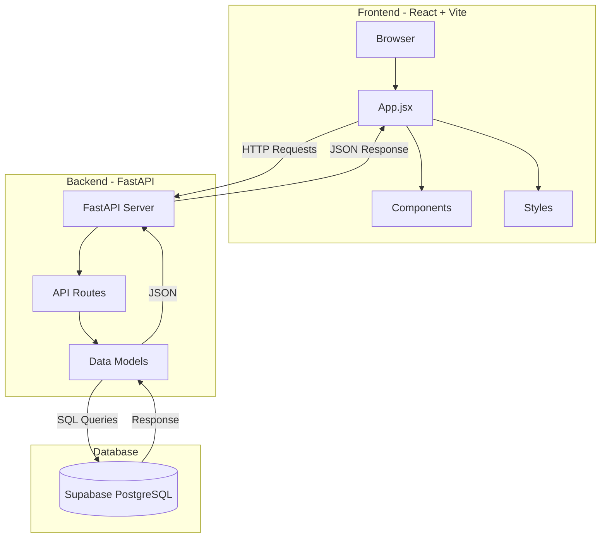
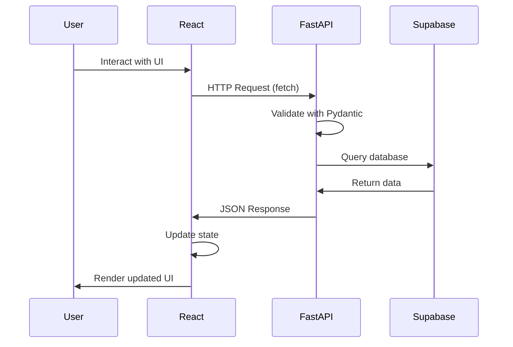

# System Architecture

## Overview

This is a fullstack web application built with React (frontend) and FastAPI (backend), using Supabase as the database.

## High-Level Architecture

## Technology Stack

### Frontend
- **React 19** - UI library
- **Vite** - Build tool and dev server
- **Native Fetch API** - HTTP requests

### Backend
- **FastAPI** - Python web framework
- **Uvicorn** - ASGI server
- **Pydantic** - Data validation
- **python-dotenv** - Environment variables

### Database
- **Supabase** - PostgreSQL database as a service
- **Supabase Client** - Python SDK for database operations

## Communication Flow

## Key Features

1. **CORS Enabled** - Frontend and backend run on different ports
2. **RESTful API** - Standard HTTP methods (GET, POST, PATCH, DELETE)
3. **Real-time Updates** - Frontend refetches data after mutations
4. **Component-Based UI** - Reusable React components
5. **Type Safety** - Pydantic models validate API data
