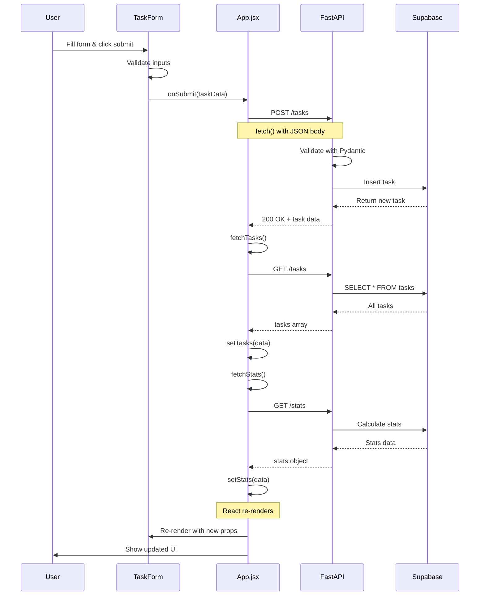
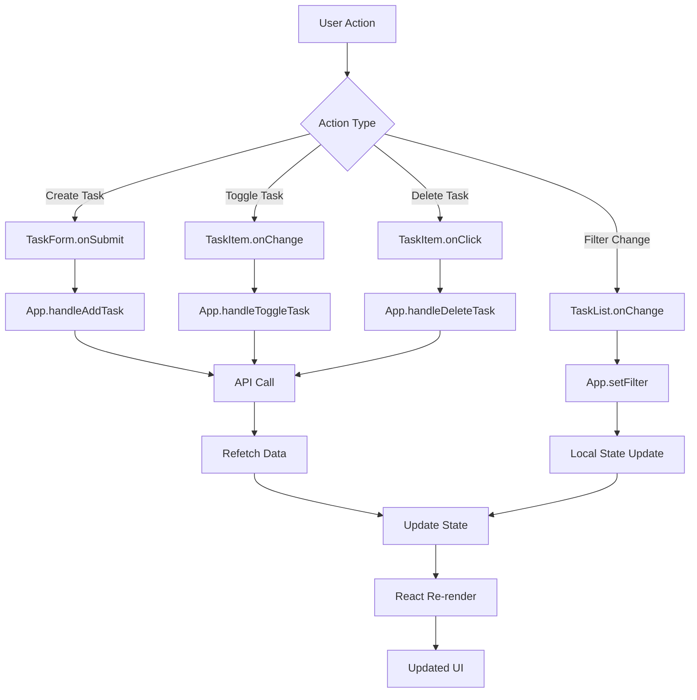
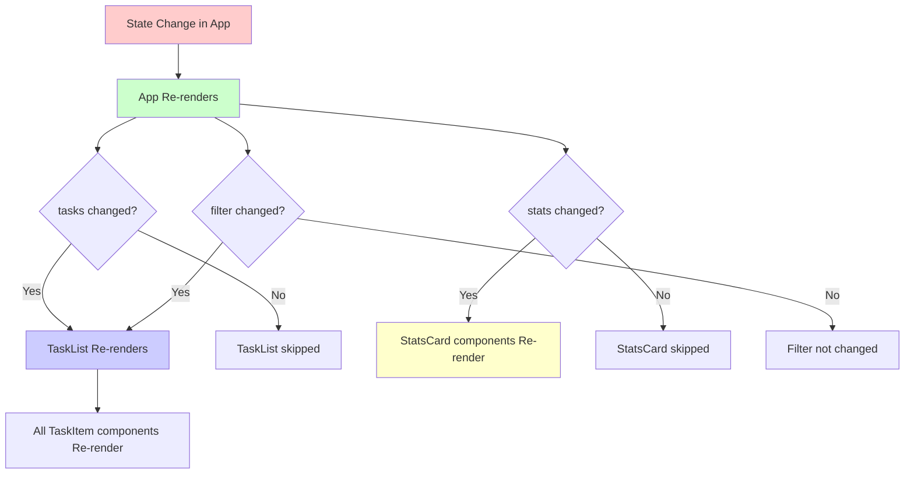
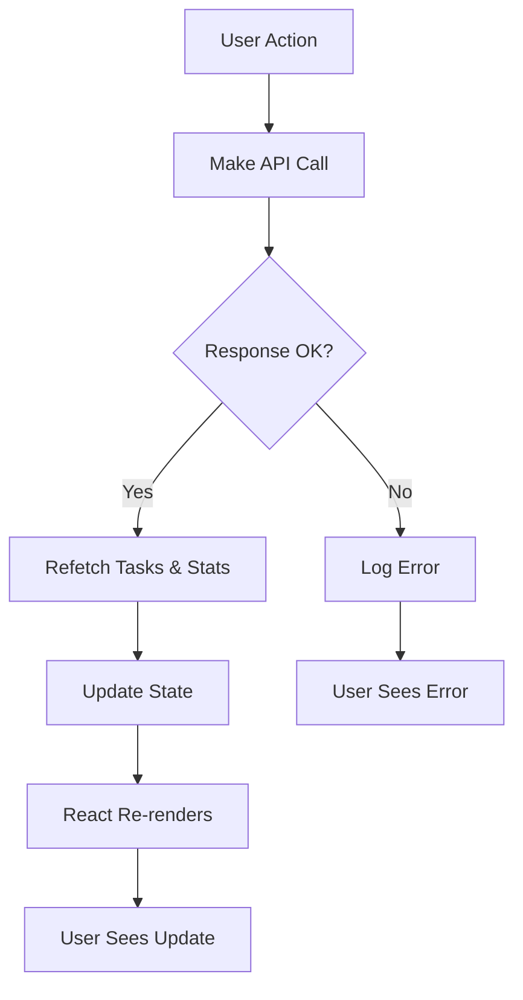
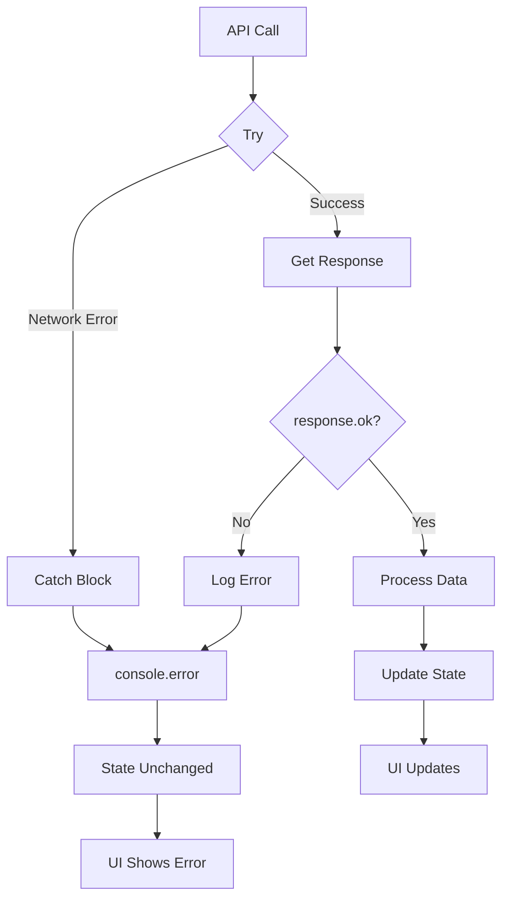

# Data Flow

## Complete Request Lifecycle

This shows how data flows through the entire application when a user adds a task.



## State Management Flow

How state changes propagate through the app.



## Component Re-render Chain

When state changes, which components re-render?



## API Call Pattern

Standard pattern used for all mutations:



## Example: Adding a Task

Step-by-step data transformation:

### 1. User Input (Form State)
```javascript
{
  title: "Write docs",
  assignedTo: "Alex",
  dueDate: "2024-11-15"
}
```

### 2. Transform for API
```javascript
{
  title: "Write docs",
  assigned_to: "Alex",    // snake_case for API
  due_date: "2024-11-15"
}
```

### 3. Pydantic Validation (Backend)
```python
Task(
  title="Write docs",
  assigned_to="Alex",
  due_date="2024-11-15"
)
```

### 4. Database Insert
```sql
INSERT INTO tasks (title, assigned_to, due_date, completed)
VALUES ('Write docs', 'Alex', '2024-11-15', false)
RETURNING *;
```

### 5. API Response
```json
{
  "message": "Task created",
  "data": [{
    "id": 19,
    "title": "Write docs",
    "assigned_to": "Alex",
    "due_date": "2024-11-15",
    "completed": false,
    "created_at": "2024-11-02T12:00:00Z"
  }]
}
```

### 6. Frontend State Update
```javascript
// App state after fetchTasks()
tasks = [
  // ... existing tasks
  {
    id: 19,
    title: "Write docs",
    assigned_to: "Alex",
    due_date: "2024-11-15",
    completed: false,
    created_at: "2024-11-02T12:00:00Z"
  }
]
```

### 7. Component Props
```javascript
// TaskList receives
<TaskList tasks={tasks} ... />

// TaskItem receives
<TaskItem task={task} ... />
```

## Error Handling Flow



## Key Concepts

### Unidirectional Data Flow
Data flows **down** from parent to child via props.
Events flow **up** from child to parent via callbacks.

### Single Source of Truth
All application data lives in `App.jsx` state.
Child components receive data as props.

### Optimistic Updates
We could implement optimistic updates (update UI before API responds), but currently we:
1. Make API call
2. Wait for response
3. Refetch all data
4. Update state
5. UI re-renders

This is simpler and safer for learning purposes.
