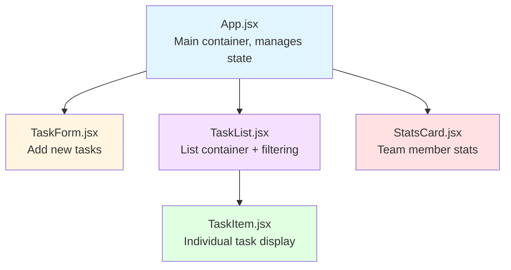
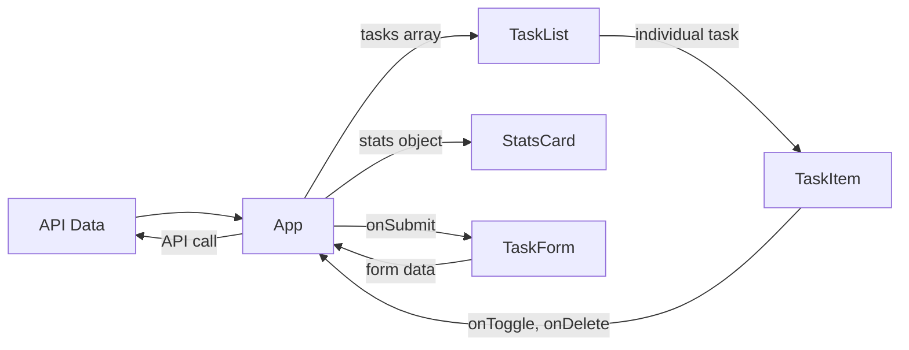

# Frontend Component Structure

## Component Hierarchy



## Component Breakdown

### App.jsx
**Purpose**: Main application container

**State**:
- `tasks` - array of task objects
- `stats` - object with team member statistics
- `filter` - current filter selection
- `loading` - loading state

**Responsibilities**:
- Fetch data from API
- Handle all API mutations (create, update, delete)
- Pass data down to child components via props
- Manage global application state

**Key Functions**:
- `fetchTasks()` - GET tasks from API
- `fetchStats()` - GET statistics from API
- `handleAddTask(taskData)` - POST new task
- `handleToggleTask(taskId, status)` - PATCH task completion
- `handleDeleteTask(taskId)` - DELETE task

---

### TaskForm.jsx
**Purpose**: Form for creating new tasks

**Local State**:
- `title` - task title
- `assignedTo` - person assigned
- `dueDate` - due date

**Props**:
- `onSubmit(taskData)` - callback when form submitted

**Responsibilities**:
- Manage form input state
- Validate required fields
- Reset form after submission
- Call parent's onSubmit function

---

### TaskList.jsx
**Purpose**: Container for tasks with filtering

**Props**:
- `tasks` - array of tasks
- `onToggle(id, status)` - toggle callback
- `onDelete(id)` - delete callback
- `filter` - current filter
- `onFilterChange(value)` - filter change callback

**Responsibilities**:
- Display filter dropdown
- Filter tasks by selected person
- Map tasks to TaskItem components
- Show empty state when no tasks

---

### TaskItem.jsx
**Purpose**: Display a single task

**Props**:
- `task` - task object
- `onToggle(id, status)` - toggle callback
- `onDelete(id)` - delete callback

**Responsibilities**:
- Show task information
- Handle checkbox interaction
- Show overdue indicator
- Trigger delete action

**Local Logic**:
- Calculate if task is overdue
- Apply appropriate styling

---

### StatsCard.jsx
**Purpose**: Display stats for one team member

**Props**:
- `person` - team member name
- `stats` - stats object with completed/pending/total

**Responsibilities**:
- Calculate completion rate percentage
- Display completed, pending, and rate

## Data Flow



## Props vs State

### When to use Props
- Passing data from parent to child
- Passing callback functions to children
- Read-only data that child shouldn't modify

### When to use State
- Data that changes over time
- Form inputs
- Local UI state (like expand/collapse)
- Data from API calls

## Component Communication

All data flows **down** through props, and actions flow **up** through callbacks:

```
User clicks checkbox in TaskItem
  -> TaskItem calls onToggle (passed from parent)
    -> TaskList calls onToggle (passed from parent)
      -> App calls handleToggleTask
        -> App makes API call
          -> App updates state with new data
            -> New data flows down to components
```
