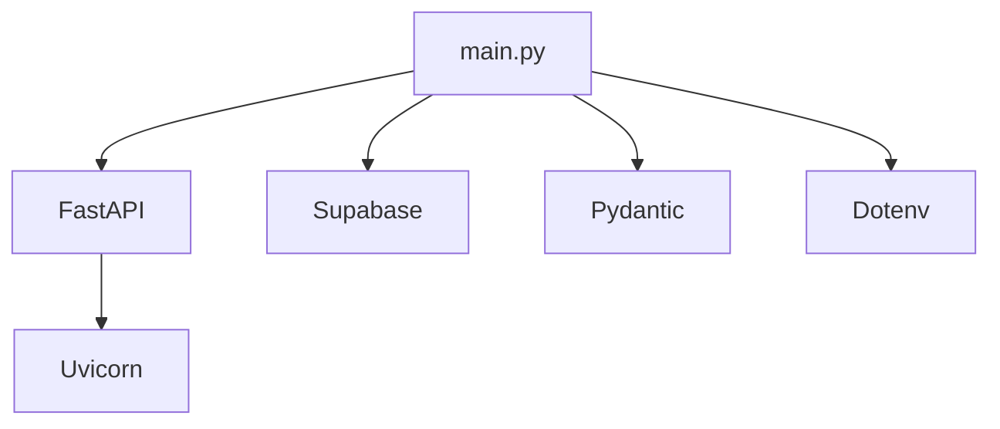
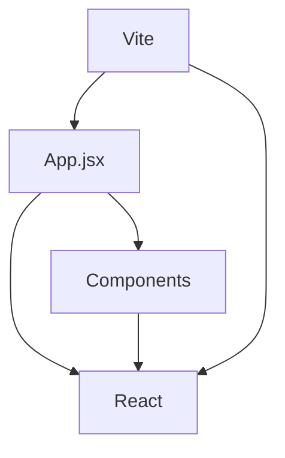

# Project Structure

## Directory Tree

```
fullstack/
├── backend/                    # Python FastAPI backend
│   ├── main.py                # Main FastAPI application
│   ├── requirements.txt       # Python dependencies
│   ├── .env                   # Environment variables (not in git)
│   └── README.md              # Backend documentation
│
├── frontend/                   # React + Vite frontend
│   ├── public/                # Static assets
│   ├── src/                   # Source code
│   │   ├── components/        # React components
│   │   │   ├── TaskItem.jsx   # Individual task display
│   │   │   ├── TaskList.jsx   # Task list container
│   │   │   ├── TaskForm.jsx   # Add task form
│   │   │   └── StatsCard.jsx  # Stats display
│   │   ├── App.jsx            # Main app component
│   │   ├── App.css            # Main styles
│   │   ├── main.jsx           # React entry point
│   │   └── index.css          # Global styles
│   ├── index.html             # HTML template
│   ├── package.json           # Node dependencies
│   ├── package-lock.json      # Dependency lock file
│   ├── vite.config.js         # Vite configuration
│   └── eslint.config.js       # ESLint configuration
│
├── docs/                       # Documentation
│   ├── architecture.md        # System architecture
│   ├── frontend-components.md # Component structure
│   ├── api-reference.md       # API endpoints
│   ├── data-flow.md           # Data flow patterns
│   ├── setup-guide.md         # Setup instructions
│   └── project-structure.md   # This file
│
├── .git/                       # Git repository
├── .gitignore                 # Git ignore rules
└── README.md                  # Project overview
```

## File Purposes

### Backend Files

#### `main.py`
The entire backend application in one file.

**Contents**:
- FastAPI app initialization
- CORS middleware setup
- Supabase client connection
- Pydantic models (Task, TaskUpdate)
- API route handlers (GET, POST, PATCH, DELETE)

**Why one file?**
- Simple to understand
- Easy to navigate
- No over-engineering
- Perfect for learning

#### `requirements.txt`
Python package dependencies.

```txt
fastapi        # Web framework
uvicorn        # ASGI server
supabase       # Database client
python-dotenv  # Environment variables
pydantic       # Data validation
```

#### `.env`
Environment variables (never commit this).

```env
SUPABASE_URL=...
SUPABASE_KEY=...
```

### Frontend Files

#### `src/main.jsx`
Entry point that mounts React to the DOM.

```javascript
ReactDOM.createRoot(document.getElementById('root')).render(
  <App />
)
```

#### `src/App.jsx`
Main application component.

**Responsibilities**:
- State management (tasks, stats, filter)
- API calls
- Passing props to child components

#### `src/components/`
Reusable UI components.

**Component Hierarchy**:
```
App
├── StatsCard (for each team member)
├── TaskForm
└── TaskList
    └── TaskItem (for each task)
```

#### `src/App.css`
All application styles in one file.

**Why one CSS file?**
- Simple to find styles
- No CSS modules complexity
- Easy to learn
- Component classes are obvious

### Documentation Files

#### `docs/architecture.md`
High-level system design with Mermaid diagrams.

#### `docs/frontend-components.md`
Component breakdown and props documentation.

#### `docs/api-reference.md`
Complete API endpoint reference.

#### `docs/data-flow.md`
How data moves through the application.

#### `docs/setup-guide.md`
Step-by-step setup instructions.

## Configuration Files

### `vite.config.js`
Vite build tool configuration.

```javascript
export default defineConfig({
  plugins: [react()],
})
```

### `eslint.config.js`
JavaScript linting rules.

### `package.json`
Node.js project configuration.

**Important scripts**:
```json
{
  "scripts": {
    "dev": "vite",           // Start dev server
    "build": "vite build",   // Build for production
    "preview": "vite preview" // Preview production build
  }
}
```

## Key Design Decisions

### Single File Backend
We keep the entire backend in `main.py` because:
- Easier to understand for beginners
- No need to jump between files
- Clear flow from top to bottom
- Can be split later if needed

### Component-Based Frontend
Each component is in its own file because:
- Components are reusable
- Easier to test
- Clear separation of concerns
- Follows React best practices

### Flat Component Structure
All components in one folder (no nesting) because:
- Simple project structure
- Easy to find files
- No over-organization
- Can add folders later as needed

### Single CSS File
All styles in `App.css` because:
- Simpler than CSS modules
- No build complexity
- Easy to see all styles
- Good for learning

## Dependency Management

### Backend Dependencies


### Frontend Dependencies


## Build vs Development

### Development Mode
- Backend: `uvicorn main:app --reload`
- Frontend: `npm run dev`
- Hot reloading enabled
- Detailed error messages

### Production Build
- Backend: Deploy to cloud service (Heroku, Railway, etc.)
- Frontend: `npm run build` creates optimized static files
- Deploy to Vercel, Netlify, etc.

## File Naming Conventions

### Backend
- **Python files**: `snake_case.py`
- **Environment**: `.env`

### Frontend
- **Components**: `PascalCase.jsx`
- **Styles**: `kebab-case.css` or `PascalCase.css`
- **Config**: `lowercase.config.js`

### Documentation
- **Markdown files**: `kebab-case.md`

## What's NOT Here

### Things we intentionally left out:
- No testing files (can add later)
- No CI/CD configuration (can add later)
- No Docker setup (can add later)
- No complex folder nesting (KISS principle)
- No state management library (React state is enough)
- No routing library (single page app)

### Why?
This is a **teaching tool**. We focus on:
- Understanding core concepts
- Clear code structure
- Simple architecture
- Easy to modify and extend

Once you understand these basics, you can add complexity as needed.
