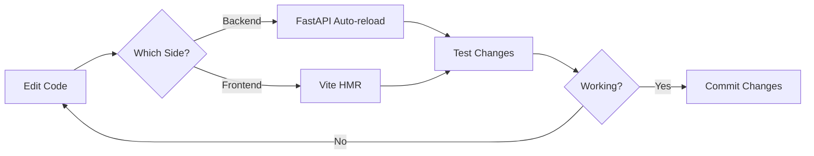

# Setup Guide

## Prerequisites

- **Python 3.10+** installed
- **Node.js 18+** and npm installed
- **Supabase account** (free tier works)
- **Git** for version control

## Quick Start

### 1. Clone Repository
```bash
git clone https://github.com/clg236/pip-fullstack.git
cd pip-fullstack
```

### 2. Backend Setup

```bash
# Navigate to backend folder
cd backend

# Install dependencies
pip install -r requirements.txt

# Create .env file
# Add your Supabase credentials (see below)

# Start the server
uvicorn main:app --reload --port 8000
```

Backend will run on: `http://localhost:8000`

### 3. Frontend Setup

```bash
# Navigate to frontend folder (from project root)
cd frontend

# Install dependencies
npm install

# Start dev server
npm run dev
```

Frontend will run on: `http://localhost:5173`

## Environment Variables

### Backend `.env`

Create `backend/.env` file:

```env
SUPABASE_URL=your_supabase_project_url
SUPABASE_KEY=your_supabase_anon_key
```

Get these from your Supabase project:
1. Go to Supabase Dashboard
2. Select your project
3. Go to Settings > API
4. Copy `Project URL` and `anon public` key

## Supabase Database Setup

### Create Tasks Table

Run this SQL in Supabase SQL Editor:

```sql
CREATE TABLE tasks (
  id BIGSERIAL PRIMARY KEY,
  title TEXT NOT NULL,
  assigned_to TEXT NOT NULL,
  due_date DATE NOT NULL,
  completed BOOLEAN DEFAULT FALSE,
  created_at TIMESTAMPTZ DEFAULT NOW()
);

-- Add some sample data
INSERT INTO tasks (title, assigned_to, due_date, completed) VALUES
  ('Set up project repository', 'Alex', '2024-10-15', true),
  ('Design database schema', 'Alex', '2024-10-20', true),
  ('Create UI mockups', 'Jordan', '2024-10-18', true),
  ('Build homepage component', 'Jordan', '2024-10-28', false),
  ('Research competitor apps', 'Sam', '2024-10-12', true),
  ('Write unit tests', 'Taylor', '2024-10-26', false);
```

## Verification

### Test Backend

```bash
curl http://localhost:8000
# Should return: {"message":"Team Accountability Tracker API"}

curl http://localhost:8000/tasks
# Should return: {"tasks": [...]}
```

### Test Frontend

1. Open browser to `http://localhost:5173`
2. You should see the Team Accountability Tracker
3. Tasks should load from the database
4. Try adding a new task

## Development Workflow



### Hot Reloading

Both servers support hot reloading:

- **Backend**: FastAPI auto-reloads when you save Python files
- **Frontend**: Vite Hot Module Replacement (HMR) updates instantly

### Making Changes

1. Edit your code
2. Save the file
3. Changes appear automatically
4. No need to restart servers

## Common Issues

### Backend won't start
- Check Python version: `python --version`
- Verify .env file exists and has correct credentials
- Make sure port 8000 is not already in use

### Frontend won't start
- Check Node version: `node --version`
- Delete `node_modules` and run `npm install` again
- Make sure port 5173 is not already in use

### CORS errors
- Verify backend CORS settings in `main.py`
- Check that frontend is running on `http://localhost:5173`
- Backend must allow that origin

### Database errors
- Verify Supabase credentials in `.env`
- Check that `tasks` table exists in Supabase
- Verify Supabase project is active (not paused)

## Project Structure

```
fullstack/
├── backend/
│   ├── main.py              # FastAPI app
│   ├── requirements.txt     # Python dependencies
│   └── .env                 # Environment variables (create this)
├── frontend/
│   ├── src/
│   │   ├── components/      # React components
│   │   ├── App.jsx          # Main app
│   │   ├── App.css          # Styles
│   │   └── main.jsx         # Entry point
│   ├── package.json         # Node dependencies
│   └── vite.config.js       # Vite config
├── docs/                    # Documentation (you are here)
└── README.md                # Project overview
```

## Next Steps

1. Read [architecture.md](architecture.md) to understand the system design
2. Read [frontend-components.md](frontend-components.md) to learn about components
3. Read [api-reference.md](api-reference.md) to see available endpoints
4. Read [data-flow.md](data-flow.md) to understand how data moves through the app
5. Start building your own features!

## Development Tips

- Use browser DevTools Network tab to see API requests
- Use browser Console to see React state and errors
- FastAPI provides automatic docs at `http://localhost:8000/docs`
- Check Supabase dashboard to see database changes in real-time
